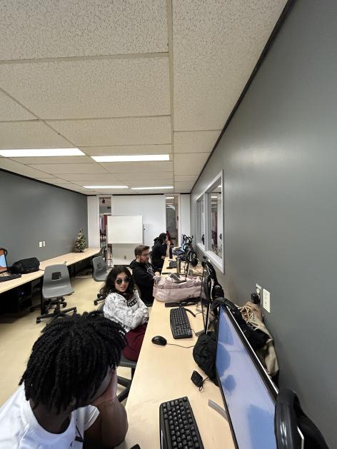
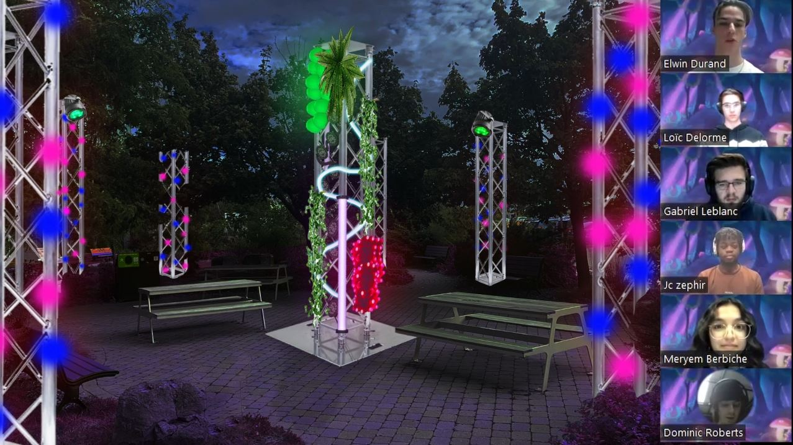
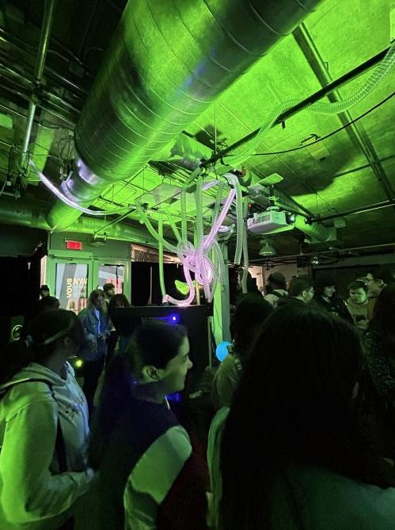
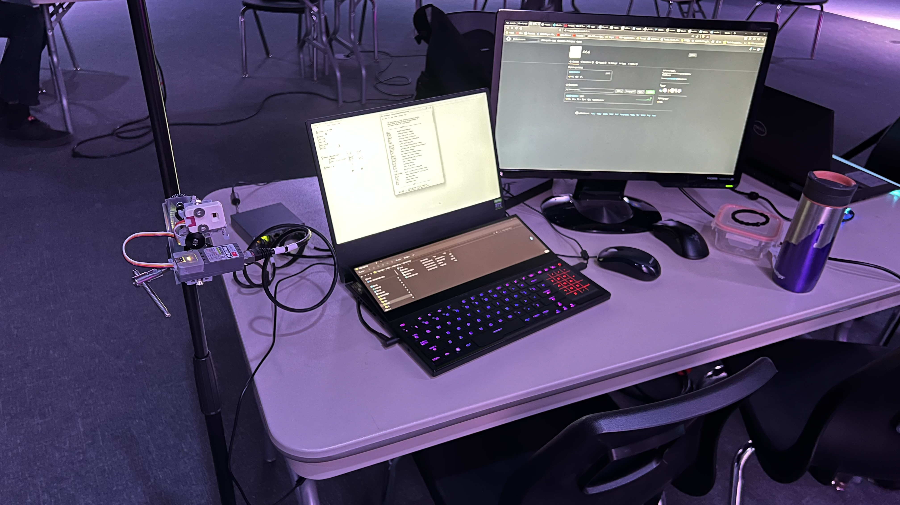
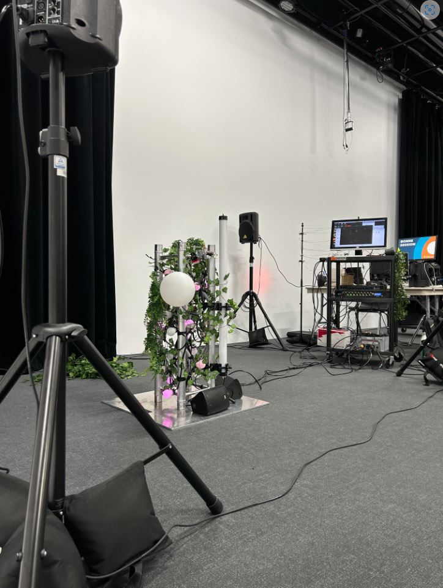
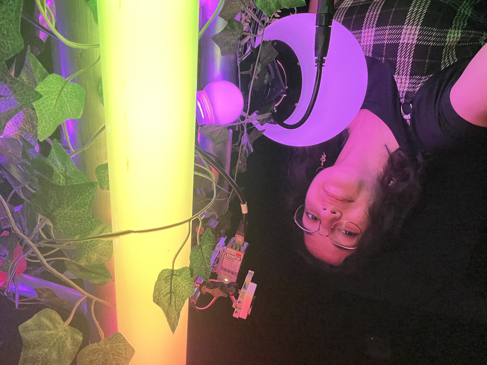
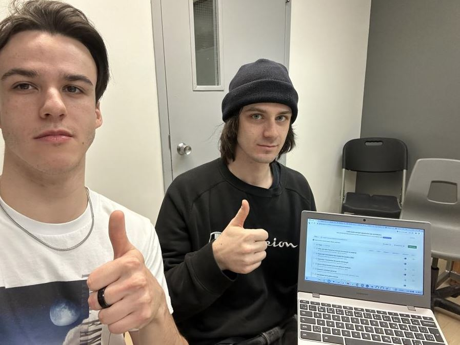
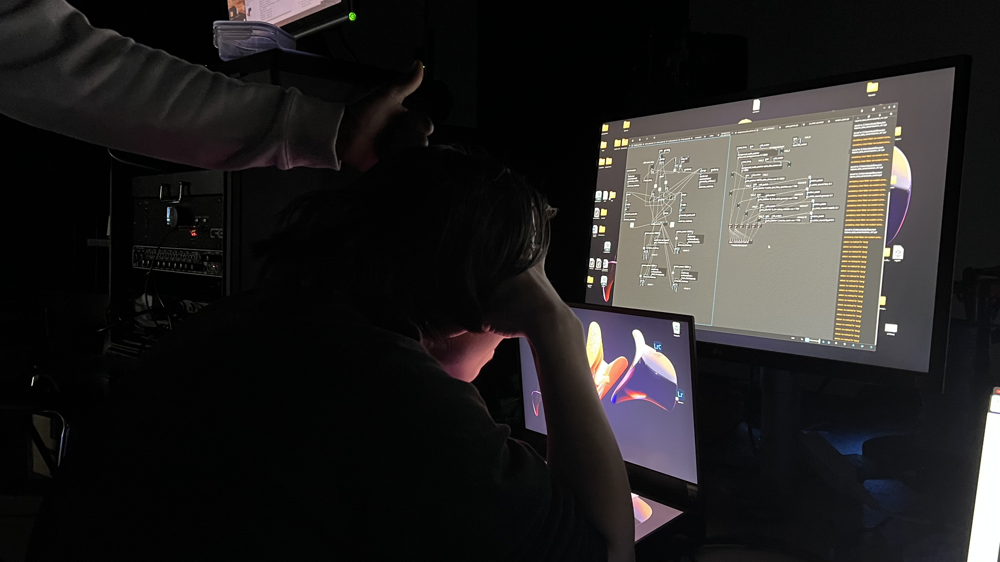
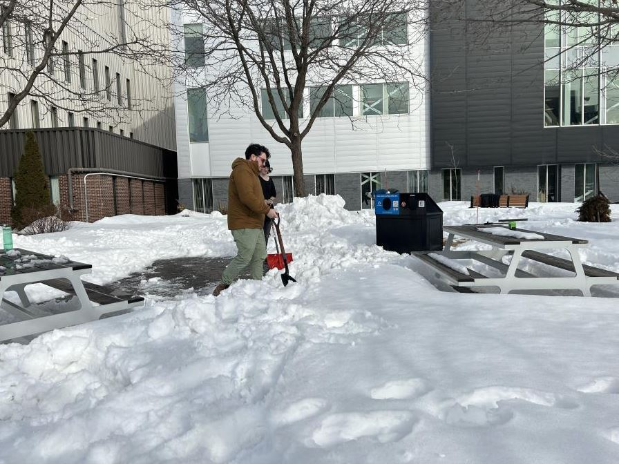
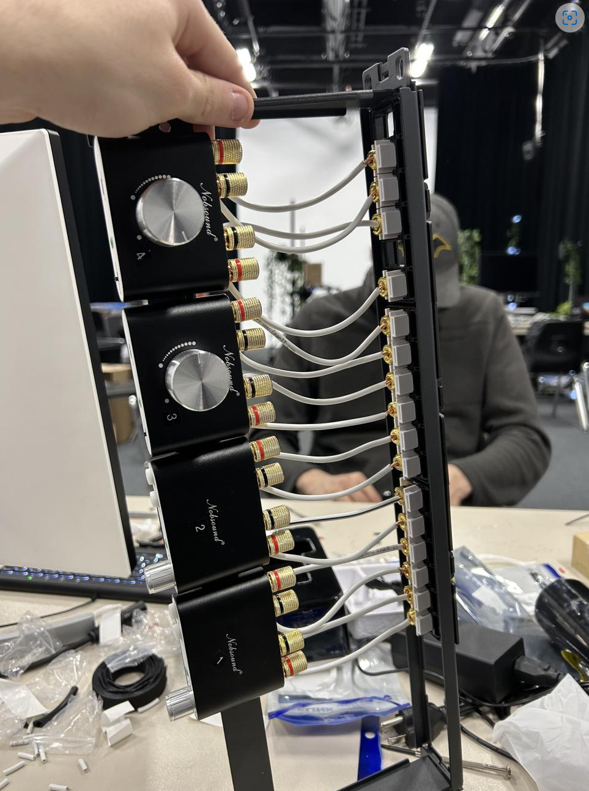

# Journal de création

## Semaine 1
> Contenu personnalisé à remplir par les équipes à chaque semaine faisant part du processus de création: résumé des réalisations d'équipe effectuées et des défis rencontrés sous forme d'un texte; ajout de vidéos, images, documents audios ou de contenu multimédia.)

Tout d'abord, ce retour en classe nous a permis d'effectuer plusieurs réunions d'équipe, entre nous et avec les professeurs, afin de réorganiser nos idées et redéfinir nos priorités par rapport au projet. 

Par la suite, nous devons réarranger notre préproduction. En effet, suite aux changements de directions par rapport à notre projet, beaucoup d'équipements et d'installations que nous avions prévu s'en retrouvent altérés. Nous avons refait une liste de notre budget et de nos besoins de matériel en tenant compte de ce que cr34te peut nous offrir. (Pas final)

Nous avons prévu de tourner la vidéo de présentation de préproduction dans le weekend à venir, il faut donc une préproduction complète à temps. 

Nous avons bien hâte d'avoir accès à des échantillons du matériel de cr34te!

## Semaine 2

Cette semaine a été riche en rebondissements. En premier lieu, nous avons changé la façon dont notre interactivité allait marcher. L'idée de la structure centrale semble promettante, et simplifie notre projet. 

En 2e lieu, nous avons refait la vidéo de présentation de la préproduction. Suite aux commentaires des professeurs sur la première, cette 2e vidéo est plus précise et concise. Elle devrait bien permettre à n'importe qui de comprendre la direction de notre projet.

En 3e lieu, les équipes d'intégration ainsi que d'installations ont réalisé des schémas/scénarimages détaillés. Ces réalisations donnent vraiment une idée claire du déroulement de l'expérience.

Le budget est assez complet, nous attendons donc les échantillons de cr34te afind de pouvoir jouer avec. La grande majorité des préparatifs sont terminés, nous pourrons normalement commencer la production la semaine prochaine.

## Semaine 3

Cette semaine nous a permis de commencer la production concrète de notre projet. D'abord, nous avons rendu visite aux étudiants de l'UQAM. L'objectif était d'observer les avancées des projets tout en révélant les notres, avec les videos de préproduction que nous avions préparé.

Par la suite, nous avons effectué des rencontres en groupe et individuelles avec Elwin. Nous manquions d'échéanciers précis, et chaque membre de l'équipe possède des dealines qui leur sont propres. Afin de rendre le processus clair, un échéancier global a été établi. 

Suite à cela, il était normalement prévu d'aller chercher des échantillons chez cr34te jeudi 9 Février, mais la sortie n'a pas pu se faire suite suite à un manque de communication de la compagnie. La team d'intégration a commencé a tester des médias sur les logiciels importants, comme madmapper par exemple. 

Nous espérons vraiment avoir accès à du matériel de cr34te pour la semaine prochaine, la team d'installation en a vraiment besoin. Autre que ça, nous avançons bien, et chacun s'attelle à ses tâches respectives. 

## Semaine 4

Cette semaine, nous avons reçu des exemplaires de matériel de cr34te. Cependant, le matériel ne nous est prêté que pour 1 semaine (donc à remettre lundi 20 février). Nous nous sommes donc activés afin de délivrer un prototype d'installation et d'interactivité pour le vendredi 17 février. Chacun s'est concentré sur ses tâches respectives, et le résultat final a donné un résultat satisfaisant, même avec cette limite de temps conçernant le matériel. 

Pour la team d'installation, Dominic, Loic et Elwin se sont attelés à simuler le poteau central qui servira de support pour l'interactivité. La structure fait environ le 2/5 de la taille finale que nous utiliserons, et les speakers sont également disposés aux alentours. Nous avons également ajouté des fausses plantes pour avoir un aperçu esthétique du poteau.

Pour la team d'intégration, les médias sont en train de se créer et avancent a bon rythme. Nous avons pu en tester quelques uns pour le prototype.
La liaison puredata entre les données captées par les sensors et le logi9 permet au utilisateurs de bien être détectés lorsque quelqu'un se place devant le sensor. 

Certains agencements de lumière on été changés en cours de route afin de rendre la structure centrale plus belle esthétiquement parlant (elle peut paraitre surchargée lorsque toutes les lumières sonmt ouvertes en même temps). 

Les animations de lumière avancent à bon rythme en accordance avec les sons qui sont créés. Chaque animation de lumière dépend de l'ambiance sonore, nous essayons donc de toujours garder en tête l'influence qu'aura le son dans la scène.

Pour la semaine prochaine, nous devrons rendre la mtériel qui nous a servi de prototype. La team d'installation commencera les plans détaillés qui serviront de référence pour cr34te lorsqu'ils viendront installer le matériel. Pour la team d'intégration, il s'aggira d'avancer les médias le plus possible afin de couvrir les différentes phases Sommeil-Éveil-Climax. 

Nous aurons également des présentations à faire dans le cadre de la technique. Nos tests ont été plutôt concluants, nous saurons expliquer en détail les divers méchanismes et interactions entre les différentes technologies présentes dans Edria.

## Semaine 5
Cette semaine, nous en avons profité pour faire des ajustements et des test de matériel ainsi que de médias. Nous avons pu garder le matériel de cr34te qui a été prêté, et tout le monde fait preuve de minutie afin de donner un résultat satisfaisant. 

En terme d'installation, tous les tests avec le matériel disponibles ont été réalisés, et des schémas de branchement ont été réalisés. Les sensors marchent bien, mais nous pensons en utiliser des plus étanches, comme par exemple, les sensors utilisés sur les voitures. Nous continuons donc de faire des tests au fur et à mesure que le matériel commandé arrive.

En terme d'intégration, la création des médias se déroule sans encombre. Les animations de lumière marchent bien et rendent bien sur madmapper. La plupart des extraits sonores sont utilisés comme références pour les animations. Nous n'avons pas tant testé les animations et les rendus de couleur UV par contre. 

Important de noter que la plupart des tâches de chaque membre de l'équipe se concrétisent, il faut donc continuer à garder une organisation claire et une bonne communication entre les avancées des membres de l'équipe. 

Cette semaine, nous avons également eu des présentations de projet. Mardi 21 février, 2square sont venus filmer et regarder les équipes pendant le dévloppement du projet. Ils en ont profité pour poser des questions et nous interviewer sur notre processus de création, notre ressenti par rapport au projet, etc.
Les étudiants en 1ere année du programme sont également venus nous voir Jeudi et Vendredi de la même semaine. Notre tâche était de les guider à travers les projets du groupe. En répondant à leurs questions et en démontrant le fonctionnement d'Edria, nous croyons en avoir inspiré plus d'un.

La semaine prochaine étant une semaine de rattrapage, il n'y aura pas de réunions obligatoires à l'école. Chacun en profitera pour avancer de leur côté.
La majorité des médias devront être réalisés (pour les 3 états SOmmeil/Éveil/Climax.) Nous en profiterons pour continuer des test de matériel au fur et à mesure que ça arrive. 

## Semaine 6

Cette semaine, la but était de finir complètement les médias ainsi que de continuer à se servir du prototype déjà en place pour faire le plus d'ajustements et de réglages possibles.

En terme d'installation, nous avons mis des modules de matériel dans le rack qui ira à l'extérieur. Tout rentre juste mais il y a quand même un paquet de fils autour, des trous ont donc été percés. Nous avons également remplacé les précédents sensors par des sensors automobiles. Ceux-ci devraient se révéler plus étanches et fonctionnent par pair. Ils marchent bien lorsqu'ils ne captent pas des objets étrangers. 

Conçernant l'intégration, il y a eu beaucoup de changements et de débogage. Il y a pas mal de problèmes de timing et de coordination par rapport aux sons (surround) et animations jouant durant les différents états d'Edria, particulièrement pour le climax. Les médias sont cependant pas mal terminés, il s'agit donc de les intégrer de la façon la plus smooth possible. 

Des tests de contrôle d'ordinateur à distance ont été concluants. Real VNC servira à contrôler les raspberry pi. Du OSC sera également utilisé afin de pouvoir influencer le projet lorsqu'il sera exposé dehors, dépendamment de la situation (des contrôles d'audio, d'opacité ainsi que de on/off).

De plus, comme Cr34te viendra installer et prêter tout le matériel la semaine prochaine, toutes les équipes allant dehors sont allés dénneiger les zones des projets. Les conditions météorologiques ont toujours été un de nos plus gros défis, il est essentiel de préparer le terrain en avance. 

Pour la semaine prochaine, le but sera d'installer tout le matériel de cr34te et d'optimiser notre temps ainsi que notre organisation, vu qu'il ne nous reste pas beaucoup de temps. Il s'agira également de compléter les ajustements d'intégration afin de pouvoir le faire rouler correctement en prévision du vernissage de la semaine d'après. 

La charge de travail restante est grande, mais nous sommes confiants en notre capacité à tout mener à terme.

## Semaine 7
Cette semaine, nous avons enfin procédé à l'installation physique de toute notre projet à l'extérieur. 

Lundi le 13 Mars, nous avons démonté le prototype et optimisé nos médias en intégration ainsi quue notre matériel en terme d'installation. Le tout afin d'être prêt pour quand Cr34te viendra livrer le matériel le lendemain. 

Mardi le 14 Mars a été le jour ou Cr34te est venu nous livrer le matériel et nous ont aidé à installer les bases du projet. Nous avons pu installer les structures métalliques ainsi que les dmx sur les structures. Nous avons pu mettre du power et ainsi allumer l'installation.

Mercredi le 15 Mars, nous avons pu installer les speakers dans les structures métalliques. Il fallait également conduire pas mal de tests audio afin de faire sortir les bons sons dans les bonnes sorties. Nous n'avions pas la caisse pour le subwoofer et nous du attendre Jeudi. 

Jeudi le 16 Mars, nous avons réussi à installer les sensors sur la structure centrale. Encore une fois, il y avait pas mal de tests à effectuer afin de les rendre fonctionnels pour nos 3 états. Il s'agissait également de faire fonctionner la synchronisation entre les animations de lumière, les sons et les DMX, à partir du repérage des sensors.

Vendredi le 17 Mars, le but était de finaliser l'installation extérieure ainsi que le bon déroulement de l'expérience. L'oeuvre devait être assez complête et fonctionner assez bien selon nos 3 états. Des étudiants du programme sont venus voir l'oeuvre en pleine action, et les profeseurs sont également venus faire des tests pour pointer ce qu'il fallait améliorer. 

Tout se déroule bien jusqu'à présent, le plus gros de l'installation marche bien. Il s'agit maintenant de faire des réajustements et d'optimiser l'intégration ainsi que l'installation afin d'être prêts pour l'exposition publique de la semaine prochaine. nous travaillons forts et sommes confiants, c'est la dernière ligne droite.
## Semaine 8

## Semaine 9

