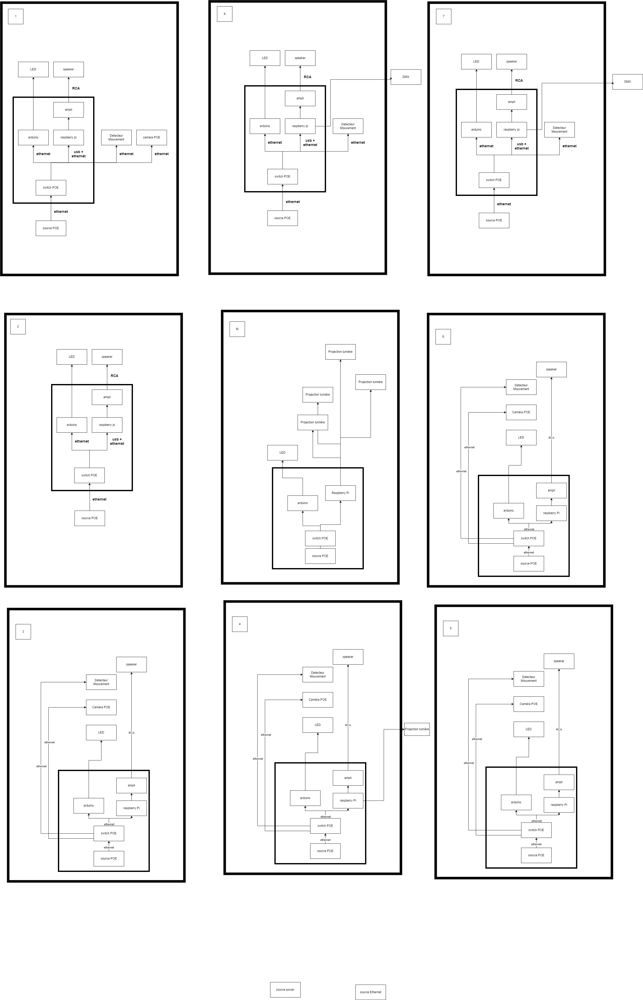
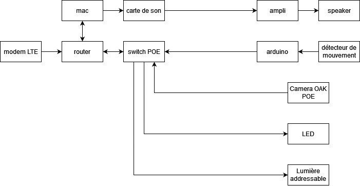
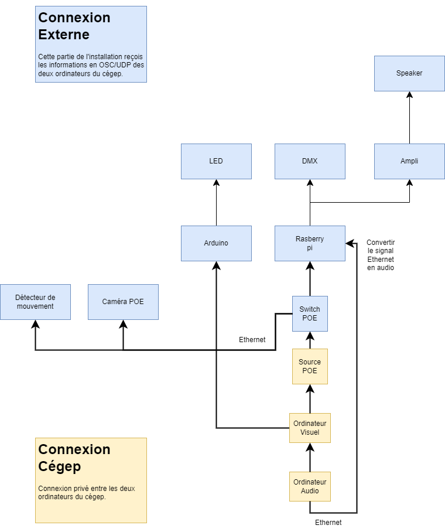
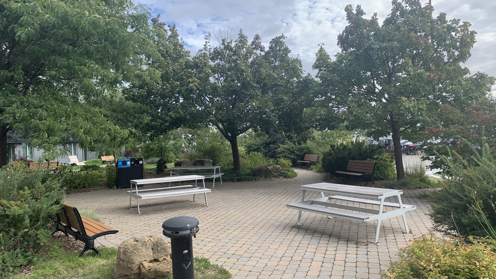
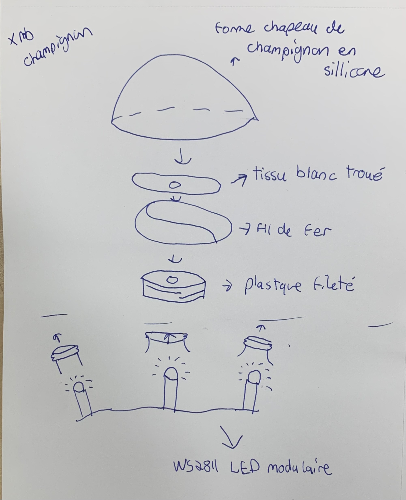
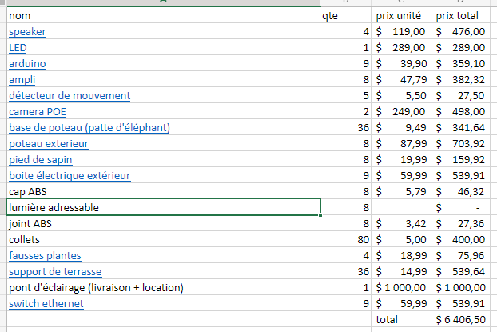

# Préproduction

# Table des matières
1. [Intention ou concept](#Intention-ou-concept)
    - [Cartographie](#Cartographie)
    - [Intention de départ](#Intention-de-départ)
    - [Synopsis](#Synopsis)
    - [Tableau d'ambiance (*moodboard*)](#tableau-dambiance-moodboard)
    - [Scénario, scénarimage ou document audio/visuel](#scénario-scénarimage-ou-document-audiovisuel)
2. [Contenu multimédia à intégrer](#Contenu-multimédia-à-intégrer)
    - [Inventaire du contenu multimédia](#Inventaire-du-contenu-multimédia)
    - [Univers artistique des éléments](#univers-artistique-des-éléments)
3. [Planification technique d'un prototype (devis technique)](#planification-technique-dun-prototype-devis-technique)
    - [Schémas ou plans techniques](#Schémas-ou-plans-techniques)
    - [Matériaux requis](#matériel-de-scénographie-requis)
    - [Équipements requis](#équipements-requis)
    - [Logiciels requis](#Logiciels-requis)
    - [Ressources humaines requises](#Ressources-humaines-requises)
    - [Ressources spatiales requises (rangement et locaux)](#ressources-spatiales-requises-rangement-et-locaux)
    - [Contraintes techniques et potentiels problèmes de production](#contraintes-techniques-et-potentiels-problèmes-de-production)
4. [Planification de la production d'un prototype (budget et étapes de réalisation)](#planification-de-la-production-dun-prototype-budget-et-étapes-de-réalisation)
    - [Budget prévisionnel](#Budget-prévisionnel)
    - [Échéancier global](#Échéancier-global)
    - [Liste des tâches à réaliser](#Liste-des-tâches-à-réaliser)
    - [Rôles et responsabilités des membres de l'équipe](#rôles-et-responsabilités-des-membres-de-léquipe)
    - [Moments des rencontres d'équipe](#moments-des-rencontres-déquipe)

# Intention ou concept
## Cartographie

### Plan d'éclairage des lumières adressables
  
Carré noir = Poteau central  
1 et 2 = Lumières pointant sur les tables  

## Intention de départ
Dans ce projet, nous souhaitons réaliser une expérience interactive reprenant le thème commun de la classe: le Biopunk. La nature et la technologie sont des idées opposées: Elles représentent une dualité. Notre installation devra ressembler à un environnement relax, dans lequel les utilisateurs pourront explorer et interagir avec ce qu'il se trouve autour d'eux. La nature aura donc une apparence "artificielle", grâce à la présence de diverses technologies aux alentours .

## Synopsis
Traversant un hiver froid et glacial, nos explorateurs arrivent en terre inconnue : Entre Fungus. Des piliers se dressent, et un écosystème hors de ce monde se dévoile sous nos yeux. Des champignons lumineux attirent l’attention des explorateurs. Intrigués, ils rentrent dans cette espace insolite et observent ce qui s’y passe : une ambiance sonore joue, les champignons changent de couleur ainsi que de rythme, et les lumières éclairent la scène. 

## Tableau d'ambiance (*moodboard*)

### Audio 
[Référence féérique](https://www.youtube.com/shorts/z6iGZhqrxRY)  
[Référence ambiophonique](https://www.youtube.com/shorts/v1o-gKb9cJc) 

### Lumières & Champignons

[Moodboard Éclairage](medias/moodboard_ambiance_eclairage.png) 
[Palette de couleurs](https://coolors.co/ffe065-fe81b4-25bcd4-1356b4-71f074) 
[Champignons](https://www.youtube.com/watch?v=GZ8umWHb2j8) 
[Lumières dans les arbres](https://www.youtube.com/watch?v=opkbghGGM30) 
[Audioréactivité texture granulaire](https://www.youtube.com/watch?v=HyF5Q9zNhZ0) 
[Ambiance générale](https://www.youtube.com/watch?v=8Nj2O60BJdk) 

## Scénario, scénarimage ou document audio/visuel
L’ambiance sonore est calme lorsqu’il n’y a personne. Quelques boules de lumières scintillent sur les poteaux à droite et à gauche doucement. Les lumières dans les arbres sont aussi allumées et scintillent doucement. Le poteau du milieu est complètement éteint. À chaque entrée ou sortie par un chemin, un son de fée se fait entendre, pendant que les boules sur les poteaux autour de l’entrée s’allument et clignotent. Lorsqu’une personne entre dans la scène, plus de boules de lumières scintillent, dont sur les arbres, pendant qu’une superposition de sons commence dans l’ambiance sonore. Le poteau du milieu a les lumières à sa base ouvertes, avec des champignons, comme un premier niveau. Il y a aussi des changements de couleurs dans les autres lumières adressables. Le nombre de boules de lumières qui s’allument et le nombre de sons se superposant dans l’ambiance sonore augmente graduellement selon le nombre de personnes, donc entre 1 et 3 personnes, dans la scène. Toujours dans la gradation, à 4 personnes, il y a de la texture granulaire qui entre dans l’ambiance sonore. Les lumières allumées et les lumières adressables réagissent avec la texture abstraite. Le poteau du milieu a des lumières et champignons augmentant niveau par niveau selon le nombre de personnes. Finalement, nous arrivons à un sommet à 5 personnes et un événement multisensoriel se déclenche. Le poteau du milieu est finalement totalement ouvert. Lorsque la 5ème personne rentre dans la scène, toutes les boules de lumières et les lumières s’éteignent d’un coup pendant quelques secondes pendant que l’on entend des voix coupées et ré-arrangées de manière générative. Les boules de lumières s’ouvrent de zone en zone, donc autour des entrées, les arbres suivant le rythme, avec les lumières adressables en suivant le son. Finalement, lorsque tous les boules de lumières et  lumières sont allumés, ils clignotent et changent de couleur tout en s’harmonisant avec l’ambiance sonore. À la fin de ce 20 secondes d’évènement spécial, l’ambiance sonore se calme, tout en entendant encore des voix. Les boules de lumières sont toutes allumées, dont certaines scintillent doucement et rapidement. Toutes les lumières sont allumées, dont le poteau  du milieu, en réagissant avec des transitions douces de couleurs tout en suivant le son. Le sommet a été atteint et l’ambiance générale est en complète harmonie. Si des personnes quittent la scène, il y a une dégradation contraire à la description ci-dessus.

# Contenu multimédia à intégrer
## Inventaire du contenu multimédia

2 paysages sonores (dont 1 modulable)

4 modules multimédias (captation des données, interprétation des données, contrôle d'éclairage et effets audiovisuels)

## Univers artistique des éléments
[Univers artistique](https://cmontmorency365-my.sharepoint.com/:x:/g/personal/2062121_cmontmorency_qc_ca/Ed-9BxbzUDpHkrCtu1kijxwBOhWSUQP5E1gXYZtl-SiaGA)

# Planification technique d'un prototype (devis technique)
## Schémas ou plans techniques

### Plantation 

### Schéma de branchement général

### Schéma complet

 ### Emplacement 
 
 
 
 ### Produit Final
 
 

### Champignons 

## Matériel de scénographie requis

* Poteaux
    * Pont d'éclairage (cr34te)
        * 1' x 1' x 8' 
        * 2' x 2' x 8'
        * 2' x 2' x 4'
    
    * specifique
        * poteau 1
            * speaker
            * détecteur de mouvement
            * arduino
            * boule lumineuse 200mm (cr34te)
            * string festoon (cr34te)
        * poteau 2
        * poteau 3
        * poteau 4
        * poteau 5
        * poteau 6
        * poteau 7
        * poteau 8
        * poteau M
## Équipements requis

* Audio
    * Haut-Parleurs Yamaha NS-AW194BL (8x)
    * fils 2 connecteur 14 gauge
    * Amplificateur 
    * carte de son
   

* Lumières
    * LED ALITOVE DC 12V WS2811 12mm
    * Arduino ATOM PoE kit with W5500
    * Lumières adressables
    * DMX Dot 5W (cr34te)
    * Boule Lumineuse 200mm (cr34te)
    * Boule Lumineuse 36" (cr34te)
    * Tubes Opal 1M (cr34te)
    * SRTING FESTOON (cr34te)
    * COLORado 2 Solo (cr34te)

* Électricité
    * Source Ethernet

* Réseau
    * Cables Ethernet de longueurs variées
    * Switch PoE 16 ports

* Ordinateur
    * capteur

* Interactivité
    * **capteur de mouvement a déterminer**
    * Caméra OAK-1 PoE
    

## Logiciels requis

FL Studio (Version 21.0.0.3324) 
VCV Rack (Version 2.2.1)  
madmapper (Version 2022.29850)  
Arduino IDE (Version 2.0.3)  

## Ressources humaines requises

* TTP, location de matériel
* Designeuse industrielle; Madame Geneviève 
* Les prof du programme TIM

## Ressources spatiales requises (rangement et locaux)

* Lieu Extérieur
    * Déploiement

* Grand Studio
    * Entreposage

* Petit Studio
    * Enregistrement audio

## Contraintes techniques et potentiels problèmes de production

| Contrainte ou problème potentiel                 | Solution envisagée                                    | Commentaires                                                                                 |
|--------------------------------------------------|-------------------------------------------------------|----------------------------------------------------------------------------------------------|
| Jamais utilisé la caméra POE. | Faire plusieurs tests et expérimenter de plusieurs façons, demander de l’aide aux professeurs ou TTP et vérifier la documentation en ligne. | Nous n’avons pas d’autres solutions pour des caméras pour l’extérieur, donc il faudra être formé. | 
|Pas beaucoup d’expérience avec TouchDesigner | Formation plus approfondie par le TTP, demander de l’aide aux professeurs ou TTP et vérifier la documentation en ligne. |  Sinon, nous pourrions essayer avec Max/MSP ou MadMapper. |                                          
 | Problème de connexion avec les cartes sonores (interface audio). | Acheter une carte de son qui se connecte avec les 7 speakers. Mettre à jours les logiciels qui ont besoin d’être mis à jour et tous leurs drivers. | Ce genre de problème empêcherait VCV Rack (et tout autre logiciel qui utilise de l’audio) de pouvoir jouer de l’audio dans les speakers. |
 |  Problème avec les envois d’informations en OSC/UDP aux logiciels réceptacles. |  Vérifier que chaque étape a bien été faite, vérifier si les informations envoyées peuvent être reçu par les logiciels réceptacles, vérifier les pares-feux. |  Ce problème enlèvera toute possibilité de communication entre les divers logiciels qui créent l’interactivité. |
 | Nous n'avons jamais fais des lumières adressables dans TouchDesigner. | Faire des recherches en regardant des vidéos en ligne, demander de l'aide aux professeurs ou aux TTPs | Sinon, on pourrais laisser tomber TouchDesigner et faire les lumières avec QLC+ |
 |  Faire la programmation de l'audio réactivité dans touch designer (connectique entre plusieurs logiciels complexe) |  Faire encore des recherches ou demander d'autre aide. |  Sinon, on pourrait laisser tomber l'audio réactivité et faire plutôt des patterns de lumière | 
 | Faire tenir les poteaux extérieurs à la verticale | Nous avons dévellopé une base qui nous semble assez robuste et qui pourra résister au intempérit, mais un être humain mal intentionné pourrait tout de même les faire tomber | C'est une partie relativement importante de notre projet alors il sera difficile de l'enlever |
 |Construction des poteaux extérieur; cette partie demande une série de technique qui est dans un autre domaine complètement de ce que nous avons vue dans la technique | Garder la structure le plus simple possible | Les plans que nous avons fait pour cette structure ne sont pas excessivement compliqué, mais ils demande des connaissance assez précise des matériaux utilisés. | 
 |  Trouver un poteau de scène qu'il serait possible de louer et qui va correspondre à nos besoins.  |  S'assurer de se prendre d'avance et de contacter un grand nombre d'entreprises afin d'être sur de ne pas être pris a faire des recherches à la dernière minute. | Ce genre de problème nous empêcherait d'avancer sur le projet puisque ce poteau est le point central de notre exposition.  |
 | Manquer d'effectif ou de temps lors de la conception des centaines de champignons. | Bien planifier et tester les étapes de la conception des champignons afin de pouvoir s'assurer d'avoir un nombre minimum de problème et que tous les gens impliqués dans la conception soient disponible dans la période de temps déterminée. |  Ce problème ferait en sorte que nous perdrions une grande partie de l'ambiance du projet puisque les champignons sont les éléments visuels principaux.|
 | Il est possible que les deadlines ne soient pas respectées, retardant les contraintes imposées. | Se prendre le plus tôt possible en prévision de chaque problème important qui pourrait venir dans notre direction. | C'est une contrainte qui dépend des membres de l'équipe, donc cela pourrait être sous contrôle avec de la prévision. |
 | La coordonation et les communications entre les membres de l'équipe peuvent être moins claires par moments. | Tenir à jour le Github en référence, ainsi qu'en créant des réseaux sociaux de communication. | Si tout le monde fait des update de leurs avancées aux réunions, cela devrait bien fonctionner. |
 | Le poteau central, dû à sa composition différente et à son importance majeure dans le projet, doit absolument être fonctionnel | Faire des test et à moins grande échelle, pour ensuite reproduire un résultat satisfaisant pour la vraie affaire | Probablement s'informer vers des distributeurs ou regarder pour du sur-mesure.| 
 | Les champignons peuvent ne pas être à l'épreuve des conditions climatiques | Créer des prototypes/échantillons qui résistent au froid et qui sont protégés. | On a déjà un prototype, mais il n'a pas été testé | 

# Planification de la production d'un prototype (budget et étapes de réalisation)
## Budget prévisionnel

[Lien vers document](https://cmontmorency365.sharepoint.com/:x:/s/FONGUSAMONGUS/EdlGhdyy8N1BpC-nrMZU9iABkAA59kKl6h62ncfrJwSruw?e=2n2DG0)

## Échéancier global
Étapes importantes du projet visualisé dans GitHub (*milestones*):  
https://github.com/F-C-A/ENTRE-FUNGUS/milestones

*Dates importantes :*
- Première itération : 31 janvier 2023
- Prototype finale : 14 février 2023
- Présentation des projets devant public : jeudi 25 mars (soir)

## Liste des tâches à réaliser
Visualisation des tâches à réaliser dans GitHub selon la méthode Kanban:  
https://github.com/orgs/F-C-A/projects/1

Inventaire des tâches à réaliser dans GitHub selon le répertoire d'*issues*:  
https://github.com/F-C-A/ENTRE-FUNGUS/issues

## Rôles et responsabilités des membres de l'équipe

**Elwin**
- Coordination générale du projet (coordination de l'échéancier, du budget, suivi de la liste des tâches à réaliser, s'assurer de la répartition du rôle et des responsabilités des membres de l'équipe);
- Coordination technique de l'équipe d'installation et d'intégration;
- Documentation du déploiement du projet;
- Tester la mise en ligne du projet;
- Tenir le journal hebdomadaire de l'équipe;

Liste des tâches dans Git Hub:  
https://github.com/F-C-A/ENTRE-FUNGUS/issues/7
https://github.com/F-C-A/ENTRE-FUNGUS/issues/8
https://github.com/F-C-A/ENTRE-FUNGUS/issues/14

**Meryem**
- Coordination de l'équipe de contenus et intéractivité;
- Création des différentes atmosphères et zones de lumières;
- Création d'une animation de lumières d'environ 60 secondes au climax (5 personnes);
- Programmation de la réactivité des lumières lorsque les textures granulaires jouent;
- Progammation de la réactivité des lumières sur les poteaux des entrées à l'entrée et à la une sortie d'une personne;
- Programmation de la réactivité du nombres de lumières allumés selon le nombre de personnes (entre 1 et 5);
- Programmation des différents niveaux sur le poteau du milieu selon le nombre de personnes (entre 1 et 5);

Liste des tâches dans Git Hub:  
https://github.com/F-C-A/ENTRE-FUNGUS/issues/22
https://github.com/F-C-A/ENTRE-FUNGUS/issues/23
https://github.com/F-C-A/ENTRE-FUNGUS/issues/24
https://github.com/F-C-A/ENTRE-FUNGUS/issues/25
https://github.com/F-C-A/ENTRE-FUNGUS/issues/26

**Gabriel**
- Création des différentes atmosphères des fixtures de lumières sur le poteau central;
- Création d'une animation de lumières d'environ 60 secondes au climax (lorsqu'il y a 5 personnes de détectées);
- Création des différentes vidéos réactives lorsqu'il y a des textures granulaires;
- Création des différentes vidéos réactives de "patterns" de lumières qui seront jouées par rapport à l'audio et au nombre de personnes détectées;

Liste des tâches dans Git Hub:
https://github.com/F-C-A/ENTRE-FUNGUS/issues/11
https://github.com/F-C-A/ENTRE-FUNGUS/issues/12
https://github.com/F-C-A/ENTRE-FUNGUS/issues/13

**Jean-Christophe**
- Création des différentes atmosphères audios qui seront jouées par rapport au nombre de personnes détectées dans la zone interactive;
- Création des paysages sonores;
- Création d'une atmosphère sonore spéciale d'environ 60 secondes au climax (lorsqu'il y a 5 personnes de détectées);
- Programmation de la réactivité du son à l'entrée ainsi qu'à la sortie d'une personne;

Liste des tâches dans Git Hub:  
https://github.com/F-C-A/ENTRE-FUNGUS/issues/15
https://github.com/F-C-A/ENTRE-FUNGUS/issues/16
https://github.com/F-C-A/ENTRE-FUNGUS/issues/17
https://github.com/F-C-A/ENTRE-FUNGUS/issues/27

**Dominic**
- Coordination de l'équipe d'installation et d'intégration;
- Direction artistique;
- Installation de la caméra, des détecteurs de mouvements et des fixtures;
- Branchement et connections;

Liste des tâches dans Git Hub:  
https://github.com/F-C-A/ENTRE-FUNGUS/issues/10
https://github.com/F-C-A/ENTRE-FUNGUS/issues/20
https://github.com/F-C-A/ENTRE-FUNGUS/issues/21

**Loic**
- Installation de la pièce centrale;
- Installation des champignons;
- Coordination de la création et de l'intégration des champignons;
- Programmation des relais de connections Arduino et PureData;

Liste des tâches dans Git Hub:  
https://github.com/F-C-A/ENTRE-FUNGUS/issues/9
https://github.com/F-C-A/ENTRE-FUNGUS/issues/18
https://github.com/F-C-A/ENTRE-FUNGUS/issues/19

**Tâches pas encore attribuées**  
https://github.com/F-C-A/ENTRE-FUNGUS/issues?q=is%3Aopen+is%3Aissue+no%3Aassignee+

## Moments des rencontres d'équipe
Hebdomadaire
- **Mardi 13h (1h-2h)** : Rencontre de suivi de projet.
- **Jeudi 13h (1h-2h)** : Rencontre de suivi de projet.

Autre: 
- **À chaque jalon (milestone)** : Rencontre de suivi de projet.
- **Quand l'installation est terminée** : Rencontre de suivi de projet.
- **Quand l'interactivité est terminée** : Rencontre de suivi de projet.
