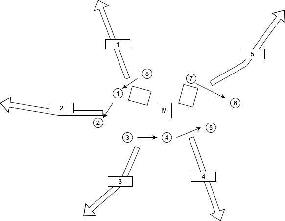
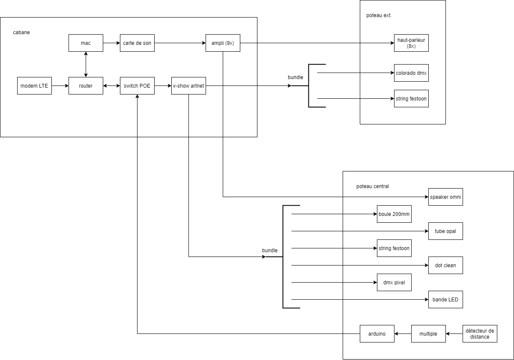
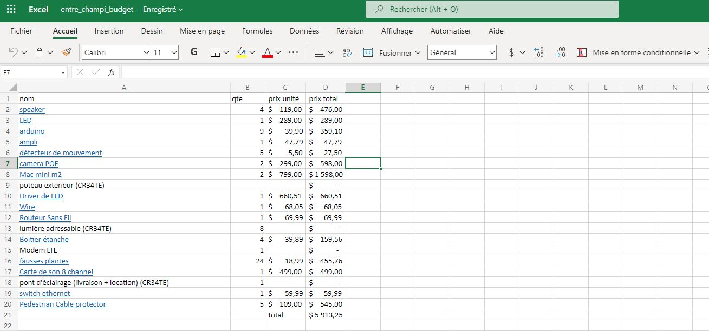

# Préproduction

# Table des matières
1. [Intention ou concept](#Intention-ou-concept)
    - [Cartographie](#Cartographie)
    - [Intention de départ](#Intention-de-départ)
    - [Synopsis](#Synopsis)
    - [Tableau d'ambiance (*moodboard*)](#tableau-dambiance-moodboard)
    - [Scénario, scénarimage ou document audio/visuel](#scénario-scénarimage-ou-document-audiovisuel)
2. [Contenu multimédia à intégrer](#Contenu-multimédia-à-intégrer)
    - [Inventaire du contenu multimédia](#Inventaire-du-contenu-multimédia)
    - [Univers artistique des éléments](#univers-artistique-des-éléments)
3. [Planification technique d'un prototype (devis technique)](#planification-technique-dun-prototype-devis-technique)
    - [Schémas ou plans techniques](#Schémas-ou-plans-techniques)
    - [Matériaux requis](#matériel-de-scénographie-requis)
    - [Équipements requis](#équipements-requis)
    - [Logiciels requis](#Logiciels-requis)
    - [Ressources humaines requises](#Ressources-humaines-requises)
    - [Ressources spatiales requises (rangement et locaux)](#ressources-spatiales-requises-rangement-et-locaux)
    - [Contraintes techniques et potentiels problèmes de production](#contraintes-techniques-et-potentiels-problèmes-de-production)
4. [Planification de la production d'un prototype (budget et étapes de réalisation)](#planification-de-la-production-dun-prototype-budget-et-étapes-de-réalisation)
    - [Budget prévisionnel](#Budget-prévisionnel)
    - [Échéancier global](#Échéancier-global)
    - [Liste des tâches à réaliser](#Liste-des-tâches-à-réaliser)
    - [Rôles et responsabilités des membres de l'équipe](#rôles-et-responsabilités-des-membres-de-léquipe)
    - [Moments des rencontres d'équipe](#moments-des-rencontres-déquipe)

# Intention ou concept

## Intention de départ
Dans un univers féerique, rassembler autour d'une sculpture représentant la dualité entre la technologie et la nature. La nature aura donc une apparence "artificielle", grâce à la présence de diverses technologies aux alentours. 

## Cartographie

### Schéma des passe fils.
  

## Synopsis
Traversant un hiver froid et glacial, des explorateurs arrivent en terre inconnue : Entre Fungus. Des piliers se dressent, et un écosystème hors de ce monde se dévoile sous leurs yeux. Une structure centrale attire l’attention des explorateurs. Intrigués, ils rentrent dans cette espace insolite et s'approchent de la dite structure: des lumières s'allument, des sons se déclenchent, et il semblerait que la présence de plusieurs personnes soit nécessaire pour progresser...

## Tableau d'ambiance (*moodboard*)

### Audio 
[Référence féérique](https://www.youtube.com/shorts/z6iGZhqrxRY)  
[Référence ambiophonique](https://www.youtube.com/shorts/v1o-gKb9cJc) 

### Lumières & Champignons
[Palette de couleurs](https://coolors.co/ffe065-fe81b4-25bcd4-1356b4-71f074) 
[Champignons](https://www.youtube.com/watch?v=GZ8umWHb2j8) 
[Lumières dans les arbres](https://www.youtube.com/watch?v=opkbghGGM30) 
[Audioréactivité texture granulaire](https://www.youtube.com/watch?v=HyF5Q9zNhZ0) 
[Ambiance générale](https://www.youtube.com/watch?v=8Nj2O60BJdk) 

 

### Références

[Na'vi River Journey, l'une des deux attractions de Pandora - The World of Avatar au Disney's Animal Kingdom](https://touringplans.com/blog/everything-you-need-to-know-about-navi-river-journey/)

## Scénario, scénarimage ou document audio/visuel
L’ambiance sonore est calme lorsqu’il n’y a personne. Quelques boules de lumières scintillent sur les poteaux à droite et à gauche doucement. Le poteau du milieu est complètement éteint. À chaque entrée ou sortie par un chemin, un son de fée se fait entendre, pendant que les boules sur les poteaux autour de l’entrée s’allument et clignotent. Lorsqu’une personne entre dans la scène, plus de boules de lumières scintillent pendant qu’une superposition de sons commence dans l’ambiance sonore. Le poteau du milieu a les lumières à sa base ouvertes, avec des champignons, comme un premier niveau. Il y a aussi des changements de couleurs dans les autres lumières adressables. Le nombre de boules de lumières qui s’allument et le nombre de sons se superposant dans l’ambiance sonore augmente graduellement selon le nombre de personnes, donc entre 1 et 3 personnes, dans la scène. Toujours dans la gradation, à 4 personnes, il y a de la texture granulaire qui entre dans l’ambiance sonore. Les lumières allumées et les lumières adressables réagissent avec la texture abstraite. Le poteau du milieu a des lumières et champignons augmentant niveau par niveau selon le nombre de personnes. Finalement, nous arrivons à un sommet à 5 personnes et un événement multisensoriel se déclenche. Le poteau du milieu est finalement totalement ouvert. Lorsque la 5ème personne rentre dans la scène, toutes les boules de lumières et les lumières s’éteignent d’un coup pendant quelques secondes pendant que l’on entend des voix coupées et ré-arrangées de manière générative. Les boules de lumières s’ouvrent de zone en zone, donc autour des entrées avec les lumières adressables en suivant le son. Finalement, lorsque tous les boules de lumières et  lumières sont allumés, ils clignotent et changent de couleur tout en s’harmonisant avec l’ambiance sonore. À la fin de ce 20 secondes d’évènement spécial, l’ambiance sonore se calme, tout en entendant encore des voix. Les boules de lumières sont toutes allumées, dont certaines scintillent doucement et rapidement. Toutes les lumières sont allumées, dont le poteau  du milieu, en réagissant avec des transitions douces de couleurs tout en suivant le son. Le sommet a été atteint et l’ambiance générale est en complète harmonie. Si des personnes quittent la scène, il y a une dégradation contraire à la description ci-dessus.

# Contenu multimédia à intégrer
## Inventaire du contenu multimédia

2 paysages sonores (dont 1 modulable)

4 modules multimédias (captation des données, interprétation des données, contrôle d'éclairage et effets audiovisuels)

## Univers artistique des éléments
[Univers artistique](https://cmontmorency365-my.sharepoint.com/:x:/g/personal/2062121_cmontmorency_qc_ca/Ed-9BxbzUDpHkrCtu1kijxwBOhWSUQP5E1gXYZtl-SiaGA)

# Planification technique d'un prototype (devis technique)
## Schémas ou plans techniques

### Schéma de branchement

 ### Emplacement 
 
 
 
 ### Produit Final
 
 

## Matériel de scénographie requis

* Poteaux
    * Pont d'éclairage (cr34te)
        * 1' x 1' x 8' (triangle)
        * 2' x 2' x 8' (carré)
    
    * specifique
        * poteau 1
            * speaker
            * string festoon 15' (cr34te)
            * fausse plante
        * poteau 2
            * speaker
            * string festoon 15' (cr34te)
            * fausse plante
            * colorado
        * poteau 3
            * speaker
            * string festoon 15' (cr34te)
            * fausse plante
        * poteau 4
            * speaker
            * string festoon 15' (cr34te)
            * fausse plante
            * colorado
        * poteau 5
            * speaker
            * string festoon 15' (cr34te)
            * fausse plante
        * poteau 6
            * speaker
            * string festoon 15' (cr34te)
            * fausse plante
            * colorado
        * poteau 7
            * speaker
            * string festoon 15' (cr34te)
            * fausse plante
        * poteau 8
            * speaker
            * string festoon 15' (cr34te)
            * fausse plante
            * colorado
        * poteau M
            * speaker
            * arduino (2x) [lien](https://shop.m5stack.com/products/pir-module)
            * LED ALITOVE DC 12V WS2811 12mm
            * Lumières adressables (x4)
            * DMX Dot 5W (cr34te)
            * DMX DOT STRING festoon ( (cr34te)
            * DMX DOT clean (64) (cr34te)
            * Boule Lumineuse 200mm (cr34te)
            * Tubes Opal 0.5M (cr34te)
            * Tubes Opal 1M (cr34te)
            * COLORado 2 Solo (cr34te)
            * fausse plante

* Cabanon central
    * mac mini
    * Carte de son 
    * Amplificateurs
    * V-Show Artnet RDM DMX Controller

## Équipements requis (Liste officielle matériel)

### Cr34te
* __Lumières__
    * (~8x25' 1x 50') DMX DOT STRING (festoon) (cr34te)
    * ( 64x ) DMX DOT CLEAR (cr34te)
    * ( 20x-25x ) Boule Lumineuse 200mm cr34te)
    * ( x1 ) Boule Lumineuse 36' cr34te)
    * ( 4x ) Tubes Opal 0.5M (cr34te)
    * ( 2x ) Tubes Opal 1M (cr34te)
    * ( x8 ) COLORado 2 Solo (cr34te)
    
* __Connection / controlleur__
    * ( ~2 ) CL-PBDF (cr34te)

* __Installation__
    * Pond d'éclairage 
        * ( x8 ) 1' x 1' x 8' (triangle)
        * ( x1 ) 2' x 2' x 8' (carré)

### À acheter 
* __Audio__
    * [( 9x ) Haut-P-arleurs Yamaha NS-AW194BL](https://www.amazon.ca/-/fr/Yamaha-NS-AW194BL-Haut-parleurs-int%C3%A9rieur-ext%C3%A9rieur/dp/B007QTAWYC)
    * [fils 2 connecteur 14 gauge](https://www.amazon.ca/dp/B01M300ZX5/ref=sspa_dk_detail_1?pd_rd_i=B00HZWYQZG&pd_rd_w=PEu8S&content-id=amzn1.sym.c7dca932-da6a-44fc-af09-cc68d2449b34&pf_rd_p=c7dca932-da6a-44fc-af09-cc68d2449b34&pf_rd_r=5FN5JM6M2R5XVBDJP136&pd_rd_wg=o112i&pd_rd_r=5f664501-b01e-46a0-b16c-2d0cb1f615d3&s=electronics&sp_csd=d2lkZ2V0TmFtZT1zcF9kZXRhaWw&spLa=ZW5jcnlwdGVkUXVhbGlmaWVyPUEzNjVEUkZESFFWT0c0JmVuY3J5cHRlZElkPUEwNDE4NTAyMzUySEFUSFhBQlVZUiZlbmNyeXB0ZWRBZElkPUEwMTQ2OTA4WVYwVlhNUDNERTVIJndpZGdldE5hbWU9c3BfZGV0YWlsJmFjdGlvbj1jbGlja1JlZGlyZWN0JmRvTm90TG9nQ2xpY2s9dHJ1ZQ&th=1)
    * [ ( x5 )Nobsound Mini Bluetooth 4.0 Digital Amplifier](https://www.amazon.ca/Nobsound-Bluetooth-Digital-Amplifier-Supply/dp/B07CWMHTCM)
    * (peut-etre) [Carte Son Externe USB SPDIF 7.1 StarTech](https://www.amazon.ca/TASCAM-US-16x08-USB-Audio-Interface/dp/B00MIXF200?th=1)
   
* __Connection / controlleur__
    * [V-Show Artnet RDM DMX Controller](https://www.amazon.com/V-Show-Artnet-RDM-DMX-Controller/dp/B09F2CBJHD)
    * [Arduino ATOM PoE kit with W5500](https://docs.m5stack.com/en/atom/atom_poe)
    * [Keystone](https://www.amazon.ca/Cable-Matters-Mount-24-Port-Keystone/dp/B0072JVT02)
    * [PowerStrip](https://www.amazon.ca/StarTech-com-RKPW161915-19-Inch-Rackmount-Distribution/dp/B003GSGNE0)

* __Réseau__
    * Cables Ethernet de longueurs variées
    * [Switch PoE 16 ports](https://www.amazon.ca/-/fr/YuanLey-Commutateur-Gigabit-commutateur-Ethernet/dp/B08QHHY7GJ/ref=sr_1_7?__mk_fr_CA=%C3%85M%C3%85%C5%BD%C3%95%C3%91&crid=21G4L0QRII2&keywords=switch%2B16%2Bport%2Bpoe&qid=1674764463&sprefix=switch%2B16%2Bport%2Bpo%2Caps%2C72&sr=8-7&th=1)
    * Modem LTE (a voir)

* __Ordinateur__
    * [( x2) MAC Mini](https://www.apple.com/ca/shop/buy-mac/mac-mini)
    
* __Interactivité__
    * ( x12 ) proximity Sensor (Guillaume) 

* __Décoration__
    * Peinture UV
    * [Peinture Luminesante](https://www.amazon.ca/Artecho-Acrylic-Supplies-Fabric-Leather/dp/B094QHDY3G/ref=sr_1_19?gclid=CjwKCAiAuOieBhAIEiwAgjCvcqZVLpZDiwGP6ph6_BNVojX3Twh2KQ4y2ZpjIXsxrfgCfMTxfuE_NRoCZwkQAvD_BwE&hvadid=208290318227&hvdev=c&hvlocphy=9000605&hvnetw=g&hvqmt=e&hvrand=9051653536197340694&hvtargid=kwd-302791761036&hydadcr=20576_9245693&keywords=luminescent%2Bpaint&qid=1675305070&sr=8-19&th=1)
    * [fougère](https://www.amazon.ca/-/fr/artificielles-am%C3%A9nagement-paysager-artificielle-ext%C3%A9rieur/dp/B0BN3NNMQR?ref_=Oct_Oct_d_onr_d_6647015011_3&pd_rd_w=AOhWA&content-id=amzn1.sym.ff4b1194-feb0-4d65-8ed9-e093f266f982&pf_rd_p=ff4b1194-feb0-4d65-8ed9-e093f266f982&pf_rd_r=NS71EYDHE8C69G6CR7WB&pd_rd_wg=90Ep1&pd_rd_r=538f1c55-3549-4d72-9945-09f1d838d06e&pd_rd_i=B0BN3NNMQR)
    * [guirlande](https://www.amazon.ca/-/fr/guirlandes-artificiel-artificielles-d%C3%A9coration-d%C3%A9v%C3%A9nement/dp/B0B4NYLBVZ?ref_=Oct_Oct_d_obs_d_6647015011_1&pd_rd_w=EGtxN&content-id=amzn1.sym.a26ace70-029b-45dd-99a6-bbbb61b20bbb&pf_rd_p=a26ace70-029b-45dd-99a6-bbbb61b20bbb&pf_rd_r=NS71EYDHE8C69G6CR7WB&pd_rd_wg=90Ep1&pd_rd_r=538f1c55-3549-4d72-9945-09f1d838d06e&pd_rd_i=B0B4NYLBVZ&th=1)
    * [lot 3 plantes artificielles](https://www.amazon.ca/-/fr/Dremisland-Lot-plantes-artificielles-suspendre/dp/B09JJRNT3M/ref=lp_6647015011_1_1?th=1)
    * [fejka](https://www.ikea.com/ca/fr/p/fejka-plante-artificielle-en-pot-interieur-exterieur-a-accrocher-40349531/)
    * [fejka](https://www.ikea.com/ca/fr/p/fejka-plante-artificielle-en-pot-interieur-exterieur-a-accrocher-eucalyptus-70466811/)
    * [fougère artificielle ext.](https://www.veronneau.com/fr/fougere-12-pkf036grgyf-16)
    * [dieffenbachia vert artificiel](https://www.veronneau.com/fr/dieffenbachia-vert-artificiel-exterieur-18-mtf23287ttgr-3)

    
## Budget prévisionnel

[Lien vers document](https://cmontmorency365.sharepoint.com/:x:/s/FONGUSAMONGUS/EdlGhdyy8N1BpC-nrMZU9iABkAA59kKl6h62ncfrJwSruw?e=2n2DG0)

## Logiciels requis

FL Studio (Version 21.0.0.3324) 
VCV Rack (Version 2.2.1)  
madmapper (Version 2022.29850)  
Arduino IDE (Version 2.0.3)  

## Ressources humaines requises

* TTP, location de matériel
* Designeuse industrielle; Madame Geneviève 
* Les prof du programme TIM
* Cr34te (équipement et installation)

## Ressources spatiales requises (rangement et locaux)

* Lieu Extérieur
    * Déploiement

* Grand Studio
    * Entreposage

* Petit Studio
    * Enregistrement audio

## Contraintes techniques et potentiels problèmes de production

| Contrainte ou problème potentiel                 | Solution envisagée                                    | Commentaires                                                                                 |
|--------------------------------------------------|-------------------------------------------------------|----------------------------------------------------------------------------------------------|
|Pas beaucoup d’expérience avec Madmapper| Formation plus approfondie par le TTP, demander de l’aide aux professeurs ou TTP et vérifier la documentation en ligne. |  Sinon, nous pourrions essayer avec Max/MSP|                                          
 | Problème de connexion avec les cartes sonores (interface audio). | Acheter une carte de son qui se connecte avec les 7 speakers. Mettre à jours les logiciels qui ont besoin d’être mis à jour et tous leurs drivers. | Ce genre de problème empêcherait VCV Rack (et tout autre logiciel qui utilise de l’audio) de pouvoir jouer de l’audio dans les speakers. |
 |  Problème avec les envois d’informations en OSC/UDP aux logiciels réceptacles. |  Vérifier que chaque étape a bien été faite, vérifier si les informations envoyées peuvent être reçu par les logiciels réceptacles, vérifier les pares-feux. |  Ce problème enlèvera toute possibilité de communication entre les divers logiciels qui créent l’interactivité. |
 | Nous n'avons jamais fais des lumières adressables dans Madmapper. | Faire des recherches en regardant des vidéos en ligne, demander de l'aide aux professeurs ou aux TTPs | Sinon, on pourrais laisser tomber Madmapper et faire les lumières avec QLC+ |
 |  Faire la programmation de l'audio réactivité dans madmapper (connectique entre plusieurs logiciels complexe) |  Faire encore des recherches ou demander d'autre aide. |  Sinon, on pourrait laisser tomber l'audio réactivité et faire plutôt des patterns de lumière | 
 | Faire tenir les poteaux extérieurs à la verticale | Nous avons dévellopé une base qui nous semble assez robuste et qui pourra résister au intempérit, mais un être humain mal intentionné pourrait tout de même les faire tomber | C'est une partie relativement importante de notre projet alors il sera difficile de l'enlever | 
 | S'assurer que le poteau central soutienne tous nos éléments d'interactivité  |   Faire des plans précis conçernant l'emplacement de chaque objet (dmx, speakers, sensors, etc)| Ce genre de problème nous empêcherait d'avancer sur le projet puisque ce poteau est le point central de notre exposition.  |
 | Il est possible que les deadlines ne soient pas respectées, retardant les contraintes imposées. | Se prendre le plus tôt possible en prévision de chaque problème important qui pourrait venir dans notre direction. | C'est une contrainte qui dépend des membres de l'équipe, donc cela pourrait être sous contrôle avec de la prévision. |
 | La coordonation et les communications entre les membres de l'équipe peuvent être moins claires par moments. | Tenir à jour le Github en référence, ainsi qu'en créant des réseaux sociaux de communication. | Si tout le monde fait des update de leurs avancées aux réunions, cela devrait bien fonctionner. |
 | Le poteau central, dû à sa composition différente et à son importance majeure dans le projet, doit absolument être fonctionnel | Faire des test et à moins grande échelle, pour ensuite reproduire un résultat satisfaisant pour la vraie affaire | Probablement s'informer vers des distributeurs ou regarder pour du sur-mesure.| 
 | Tout le matériel peut ne pas être à l'épreuve des conditions climatiques | Créer des prototypes/échantillons qui résistent au froid et qui sont protégés. | Les échantillons de cr34te devraient se montrer utiles pour reproduire à moins grande échelle nos tests d'interactivité. | 

# Planification de la production d'un prototype (budget et étapes de réalisation)

## Échéancier global
Étapes importantes du projet visualisé dans GitHub (*milestones*):  
https://github.com/F-C-A/ENTRE-FUNGUS/milestones

*Dates importantes :*
- Générale technique en studio: vendredi 17 mars au matin;
- Début de la diffusion: lundi 20 mars, 13h;
- Diffusion des projets en mode autonome: lundi 20 au jeudi 23 mars;
- Présentation aux étudiant.es de l'UQAM: date à venir;
- Vernissage devant public : jeudi 23 mars 18h30;
- Démontage: vendredi 24 mars.

## Liste des tâches à réaliser
Visualisation des tâches à réaliser dans GitHub selon la méthode Kanban:  
https://github.com/orgs/F-C-A/projects/1

Inventaire des tâches à réaliser dans GitHub selon le répertoire d'*issues*:  
https://github.com/F-C-A/ENTRE-FUNGUS/issues

## Rôles et responsabilités des membres de l'équipe

**Elwin**
 - Coordination générale du projet (coordination de l'échéancier, du budget, suivi de la liste des tâches à réaliser, s'assurer de la répartition du rôle et des responsabilités des membres de l'équipe);  
 - Coordination technique de l'équipe d'installation et d'intégration;  
 - [Documentation du déploiement du projet;](https://github.com/F-C-A/ENTRE-FUNGUS/issues/14)  
 - [Tester la mise en ligne du projet;](https://github.com/F-C-A/ENTRE-FUNGUS/issues/7)  
 - [Tenir le journal hebdomadaire de l'équipe;](https://github.com/F-C-A/ENTRE-FUNGUS/issues/8)  

**Meryem**
- Coordination de l'équipe de contenus et intéractivité;
- [Création des différentes atmosphères et zones de lumières;](https://github.com/F-C-A/ENTRE-FUNGUS/issues/22)
- [Création d'une animation de lumières d'environ 60 secondes au climax (5 personnes);](https://github.com/F-C-A/ENTRE-FUNGUS/issues/23)
- [Programmation de la réactivité des lumières lorsque les textures granulaires jouent;](https://github.com/F-C-A/ENTRE-FUNGUS/issues/24)
- [Progammation de la réactivité des lumières sur les poteaux des entrées à l'entrée et à la une sortie d'une personne;](https://github.com/F-C-A/ENTRE-FUNGUS/issues/25)
- [Programmation de la réactivité du nombres de lumières allumés selon le nombre de personnes (entre 1 et 5);](https://github.com/F-C-A/ENTRE-FUNGUS/issues/26)
- [Programmation des différents niveaux sur le poteau du milieu selon le nombre de personnes (entre 1 et 5);](https://github.com/F-C-A/ENTRE-FUNGUS/issues/46)

**Gabriel**
- [Création des différentes atmosphères des fixtures de lumières sur le poteau central;](https://github.com/F-C-A/ENTRE-FUNGUS/issues/11)
- [Création d'une animation de lumières d'environ 60 secondes au climax (lorsqu'il y a 5 personnes de détectées);](https://github.com/F-C-A/ENTRE-FUNGUS/issues/12)
- [Création des différentes vidéos réactives lorsqu'il y a des textures granulaires;](https://github.com/F-C-A/ENTRE-FUNGUS/issues/47)
- [Création des différentes vidéos réactives de "patterns" de lumières qui seront jouées par rapport à l'audio et au nombre de personnes détectées;](https://github.com/F-C-A/ENTRE-FUNGUS/issues/13)

**Jean-Christophe**
- [Création des différentes atmosphères audios qui seront jouées par rapport au nombre de personnes détectées dans la zone interactive;](https://github.com/F-C-A/ENTRE-FUNGUS/issues/15)
- [Création des paysages sonores;](https://github.com/F-C-A/ENTRE-FUNGUS/issues/16)
- [Création d'une atmosphère sonore spéciale d'environ 60 secondes au climax (lorsqu'il y a 5 personnes de détectées);](https://github.com/F-C-A/ENTRE-FUNGUS/issues/17)
- [Programmation de la réactivité du son à l'entrée ainsi qu'à la sortie d'une personne;](https://github.com/F-C-A/ENTRE-FUNGUS/issues/27)

**Dominic**
- Coordination de l'équipe d'installation et d'intégration;
- [Direction artistique;](https://github.com/F-C-A/ENTRE-FUNGUS/issues/10)
- [Installation de la caméra, des détecteurs de mouvements et des fixtures;](https://github.com/F-C-A/ENTRE-FUNGUS/issues/20)
- [Branchement et connections;](https://github.com/F-C-A/ENTRE-FUNGUS/issues/21)

**Loic**
- [Installation de la pièce centrale;](https://github.com/F-C-A/ENTRE-FUNGUS/issues/9)
- [Installation des leds et champignons;](https://github.com/F-C-A/ENTRE-FUNGUS/issues/18)
- [Coordination de la création et de l'intégration des champignons;](https://github.com/F-C-A/ENTRE-FUNGUS/issues/19)
- [Programmation des relais de connections Arduino et PureData;](https://github.com/F-C-A/ENTRE-FUNGUS/issues/48)

**Tâches pas encore attribuées**  
https://github.com/F-C-A/ENTRE-FUNGUS/issues?q=is%3Aopen+is%3Aissue+no%3Aassignee+

## Moments des rencontres d'équipe
Hebdomadaire
- **Mardi 13h (1h-2h)** : Rencontre de suivi de projet.
- **Jeudi 13h (1h-2h)** : Rencontre de suivi de projet.

Autre: 
- **À chaque jalon (milestone)** : Rencontre de suivi de projet.
- **Quand l'installation est terminée** : Rencontre de suivi de projet.
- **Quand l'interactivité est terminée** : Rencontre de suivi de projet.
